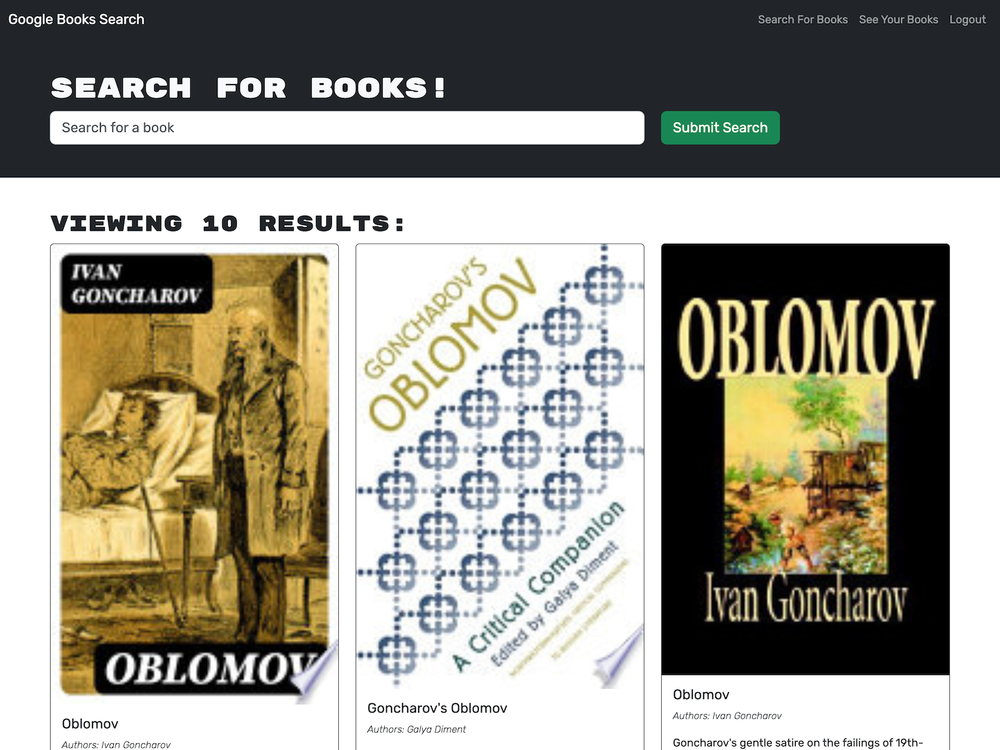

# Book Seach Engine

## Description

This project is a website that allows the user to search the Google Books API and save books that they like. It is a React app that whose backend initially utilized a REST API. I replaced this backend with one that uses GraphQL.

In completing this project, I learned to appreciate the complexity involved with refactoring others' code, especially when it comes to something as complex as a web app.

## Installation

No installation required. To run a local instance of the web page, clone the project repository from GitHub, navigate into the top level of the project's directory, and run `npm i`, `npm run build`, and finally `npm start`.

## Usage

Navigate in your browser to the deployed site at https://book-seach-engine-8dy5.onrender.com. Make sure you have JavaScript turned on! You can make an account or login, search for books, save the books you're interested in, and view and delete the books that you've saved.

For reference, here is a screenshot of the functioning site: 

## Credits

The original code for this project was provided by edX Boot Camps LLC. I modified the code to use a GraphQL API for interacting with the server instead of a REST API.

## License

No license at this time.